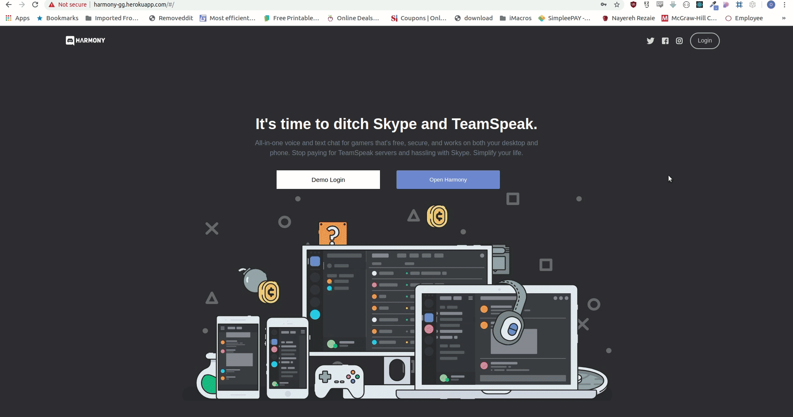

# Harmony

EasyTrade, a Robinhood clone, is an investing application that allows users to purchase and sell shares of stock in publicly-traded companies

[Live Demo](http://harmony-gg.herokuapp.com/#/)

## Technologies

- Backend: Rails/ActiveRecord/PostgreSQL/ActionCable
- Frontend: React/Redux

## Features

- End to end encryption for user authentication via BCrypt
- Spalsh page and authentication has multiple low barrier forms of entry.
- User has access to Guilds that house other Users and Channels for communicaiton via text.
- User has access to Channels inside Guilds.
- User can navigate between channels and guilds with visual feedback

### Splash, Registration, and Login

When a username logs in they are taken to a personal Home guild. Joining has a low barrier of entry.
<br />
<br />

<br />
<br />

#### Modular and Persistent Fields

Much of the logic here had to be very conditional to flow well. Each field had to be broken down into its own
separate component that coud modularly be moved around and routed to while maintaining its local state as the context changed.

```js
render() {
	const usernameField = (
		<div className="field-wrapper">
			<h5 className="field-label">USERNAME:</h5>
			<input
				className="auth-field"
				type="text"
				value={this.state.username}
				onChange={this.update("username")}
			/>
		</div>
	);
	const emailField = (
		<div className="field-wrapper">
			<h5 className="field-label">EMAIL:</h5>
			<input
				className="auth-field"
				type="text"
				value={this.state.email}
				onChange={this.update("email")}
			/>
		</div>
	);
	const passwordField = (
		<div className="field-wrapper">
			<h5 className="field-label">PASSWORD:</h5>
			<input
				className="auth-field"
				type="password"
				value={this.state.password}
				onChange={this.update("password")}
			/>
		</div>
    );
```

#### Open Harmony

The Open Harmony button functions differently depending on whether the User has a valid session token or not

If they are not logged , it will open a field that allows them to enter a Usernames are not unique,but are randomly assigned a 4 digit discriminator. That way a User can always get their favorite name.

```js
openUsernameField(e) {
	e.preventDefault();
	this.setState({ opened: true });
};

```

Otherwise it will redirect the User to their home. The largest challenge here was making sure the logic functions with elegant CSS logic as well

```js
function OpenButton({ openUsernameField, currentUser }) {
	if (!currentUser) {
		return (
			<button className="open-button" onClick={openUsernameField}>
				Open Harmony
			</button>
		);
	} else {
		return (
			<button className="open-button">
				<Link style={{ color: "white" }} to={`/home/`}>
					Open Harmony
				</Link>
			</button>
		);
	}
}
```

### Guilds and Channels

<br />
<br />

<br />
<br />

As users navigate through thier guilds and channels, the view updates dynamically with visual feedback. As they navigate through, there is visual feedback as to which Guild or Channel they are hovering over or currently in.

Each guild and channel has a websocket so the user can see what updates inside each in realtime.L0

```rb
  def subscribed
    @channel = Channel.find(params[:id])
    stream_for @channel
  end

  def speak(data)
    message = @channel.messages.new(body: data['message'], author_id: data['authorId'] )
    if message.save
      socket = { messages: message, users: message.author, channels: message.channel, type: 'message' }
      ChannelChannel.broadcast_to(@channel, socket)
    end
  end

  def load
    messages = @channel.messages
    if messages
      socket = { messages: messages, type: 'messages' }
    else
      socket = { messages: null, type: 'no
        messages'}
    end
    ChannelChannel.broadcast_to(@channel, socket)
  end
```

#### Websockets

The largest challenge here was making sure properties were loaded and threaded through properly. During initial development I didn't have any knowledge of websockets and ActionCable.

Eventually to create the functionality to smoothly connect to each, I had to go back and refactor so on User login,a socket is generated for each Guild in their sidebar. When clicking on a channel in a guild, a socket will be generated for the channel itself.

This was a very time consuming setback and slowed down development of the project, but I absolutely learned the value of understanding the tech you plan on implementing before you start planning.

I also learned that sometimes you just have to accept something doesn't work and go back and fix it rather than powering through with code that isn't scalable.

```js
componentDidUpdate(prevProps, prevState) {
	if (this.state.openedChannel !== this.props.match.params.channelId) {
		this.openChannel();
		this.setState({
			loaded: false,
			openedChannel: this.props.match.params.channelId
		});
	}
	if (this.chat && !this.state.loaded) {
		this.loadChat();
		this.setState({ loaded: true });
	}
}
```

#### ChatBox

The field at the bottom of the chatbox is connected to the channel's websocket directly. Currently the messages that flow via the socket are not visible. On enter keypress the field will send the body to the websocket.

<br />
<br />

<br />
<br />

```js
handleSubmit(e) {
	e.preventDefault();
	this.chat.speak({ message: "somemessage", authorId: 1 });
	this.setState({ body: "" });
}
addMessage(e) {
	if (e.keyCode == 13 && e.shiftKey == false) {
		this.handleSubmit(e);
	}
}

```
